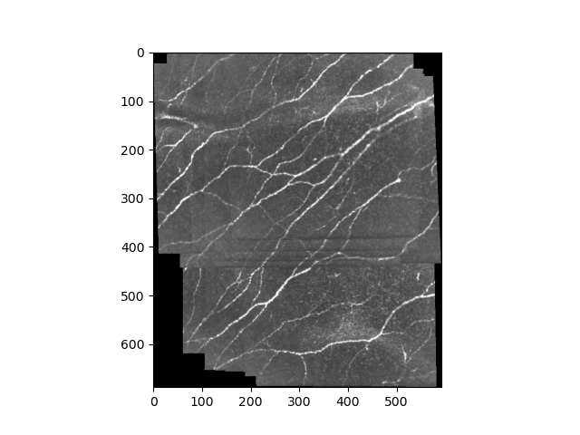
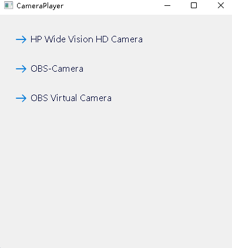

# A deep learning tool for real-time stitching and parameter quantification in corneal confocal microscopy

> Attention! This is a **Pre-release version** and the documentation is incomplete.
> 
> At the same time, the code will likely be modified after the official release.
---

## How to use?
### 1. For datasets that have already been acquired

See the usage in `example.py`.

The expected output is:

---

`
{'cnfl': 19.338700720950847, 'cnbd': 217.70390413606492, 'area': 0.40421875}
`

### 2. Real-time stitching

1) Make sure the device is receiving a video signal from the CCM, such as a USB camera.
2) Launch `ui/views/player.py` and select the corresponding video stream name.

3) Then, launch `ui/views/main.py` and click the `Stitch` button.
